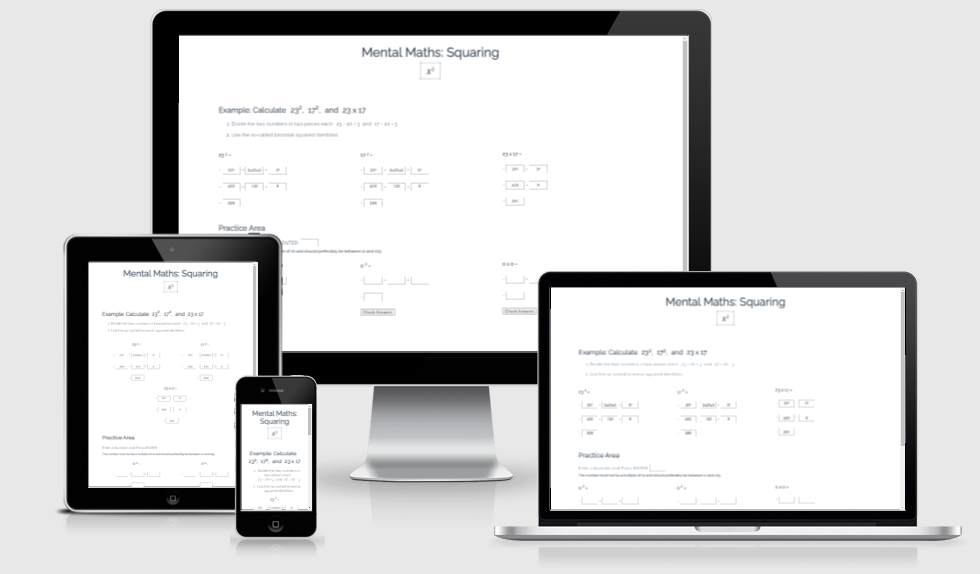
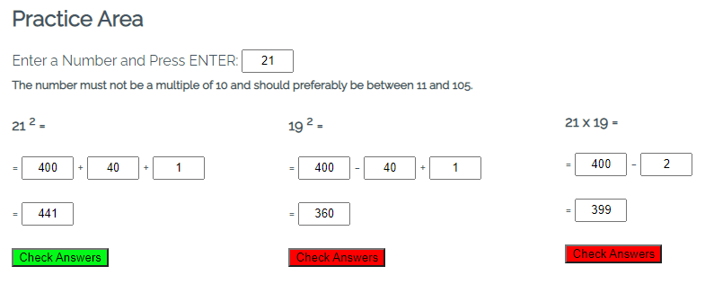
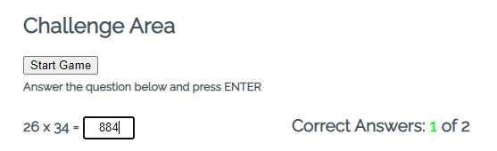
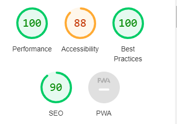

# Mental Maths: Squaring
The webpage is useful for primary or high school students in mathematics. It explains in detail how to expand a binomial squared and the related product of conjugates by first providing a simple example. After that, there is a practice section and finally a challenge section where the student can apply the explained rules to mentally calculate squares and product of conjugates.

# Table of contents

- [UX](#ux)
    - [Website owner business goals](#website-owner-business-goals)
    - [User goals](#user-goals)
    - [Structure of the website and wireframe](#structure-of-the-website-and-wireframe)
    - [Surface](#surface)
- [Features](#features)
    - [Example](#example)
    - [Practice area](#practice-area)
    - [Challenge area](#challenge-area)
    - [Future implementation](#future-implementation)
- [Technologies](#technologies)
- [Testing](#testing)
    - [Functionality testing](#functionality-testing)
    - [Responsiveness testing](#responsiveness-testing)
    - [Code validation](#code-validation)
    - [Accessibility and performance](#accessibility-and-performance)
    - [Unfixed bugs](#unfixed-bugs) 
- [Deployment](#deployment)
- [Credits](#credits)

# UX

## Website owner business goals
- The main reason to create this website is to provide help to primary or high school students in mathematics.
- Mathematics can be difficult for many and the owner wishes to explore alternative ways to teach mathematics.
- The long term goal is to add more material from different areas of mathematics.

## User goals
- The user wants to learn the binomial squared identities in a clear step by step fashion without using formulas to begin with.
- He wants to understand the use of these identities from a practical point of view, for example in calculating 23 squared.
- He wants to practice to consolidate his knowledge.
- He wants to evaluate his skills.

## Structure of the website and wireframe
Thee application was developped from the point of view of the user, and was wireframed with paper and pencil. It was decided to display all the content in one page only so that the user does not have to click back and forth between pages because he needs to follow the example section later on. The content was divided into three sections:
- One theory section explaining the basic steps of the binomial squared identities using a simple example.
- A practice section where the student can follow the steps described in the previous section to calculate the square of a number of his choice.
- A challenge section where the student can score himself calculating squares of randomly generated numbers. 

## Surface

### Colors
- Font color: #445361
- Background color: White (#fff)

### Fonts

We used Google font Raleway following the  Code Institute walkthrough project Love Maths and as a backup font Sans Serif.

### Icon

The icon comes from https://www.onlinewebfonts.com/

[Back to Table of contents](#table-of-contents)

# Features
The Mental Maths web site has three sections:

## Example 
It shows how to calculate 23^2, 17^2 and 23 x 17 by breaking them up in more easily calculated parts, namely the squares of 20 and three, and the product of 20 and three twice. This illustrates the algebraic rules of expansion of a square and product of conjugates.

## Practice area
Here the student can follow the previous example and enter a not to large number and apply the above mentioned rules to calculate the square of it. He will also calculate the related square and product. Under each calculation there is a button which turns green if every step of the calculation is correct, red otherwise. The student can practice as many times as he wishes. He cannot enter a number below 6 or a multiple of 10, partly because it becomes cumbersome and partly because the squares of them are easy to calculate anyway. When the student feels he is ready he can proceed to the challenge area.

## Challenge area
The students can test his knowledge by calculating squares and product of conjugates mentally. The application generates a random number between 11 and 109 and chooses randomly between calculating a square or a product of conjugates. The question is displayed and the student has to enter the answer in an input box and press return. If the answer is correct the input box flashes green and the score and total number of trials are incremented by one. A new question is displayed and the process continues <em>ad infinitum</em>. 

## Future implementation
The site owner wishes to add pages applying the same methodology to other areas of mathematics, for example fractions, integrals etc...

[Back to Table of contents](#table-of-contents)

# Technologies
- HTML5 for structuring content
- CSS for styling content
- JavaScript for front-end interactivity
- Github for cloud-based storage of project and deployment
- GitPod for development
- Git for version control

[Back to Table of contents](#table-of-contents)

# Testing

## Functionality testing
I checked that the application runs as expected both on PC and mobile. I verified that the input fields only accept numbers; that alerts are sent if the user enters a number less than six or a multiple of ten in the practice area; that an alert is sent if the user tries to start the game again without answering the question in the challenge area; that the color coding is correct and that the score is correct.

## Responsiveness testing
I tested the site on several virtual devices using devtools. I also tested it on my PC and on my mobile phone.

## Code validation
- One error in the HTML file occuring in several places was detected by the W3C validator. It was the use of the &sup symbol for the exponent in input fields. I tried to fix the error by using `&amp;` but then it would not write the exponent so I left it unfixed.
- The CSS file passed through the W3C validator without errors.
- The JavaScript file passes through the jshint.com validator without errors.

## Accessibility and performance

The accessibility score for my code was 88% according to lighthouse in devtools. It says that the input fields have no labels. Of the 32 input elements only one has explaining text and is labeled. It was deemed inpractical to label the remaining 31 input fields which merely were used as number containers in equations.

## Unfixed bugs
As mentioned above there is one unfixed bug but the application works despite the error.

[Back to Table of contents](#table-of-contents)

# Deployment
The site was deployed to GitHub pages. The steps to deploy are as follows:
* In the GitHub repository, navigate to the Settings tab and Pages link.
* From the source section drop-down menu, select the Master or Main Branch
* Once the Main branch has been selected, the page will be automatically refreshed with a detailed ribbon display to indicate the successful deployment.
Here is the link to the project: [Mental Maths](https://faridjos.github.io/learn-maths/index.html)

 [Back to Table of contents](#table-of-contents)

 # Credits
 - My main inspiration came from the walkthrough project Love Maths. The challenge section is in many ways similar to that project.
 - The icon comes from https://www.onlinewebfonts.com/
 - We removed arrows/spinners from number input fields using CSS code from https://www.w3schools.com/

 [Back to Table of contents](#table-of-contents)